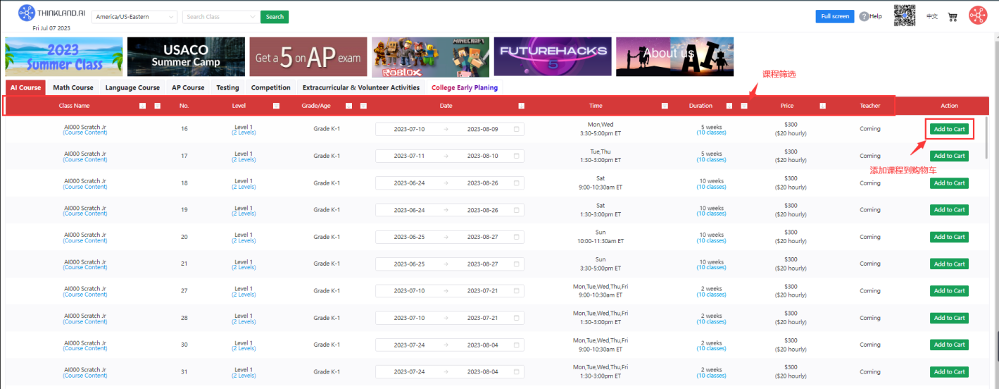
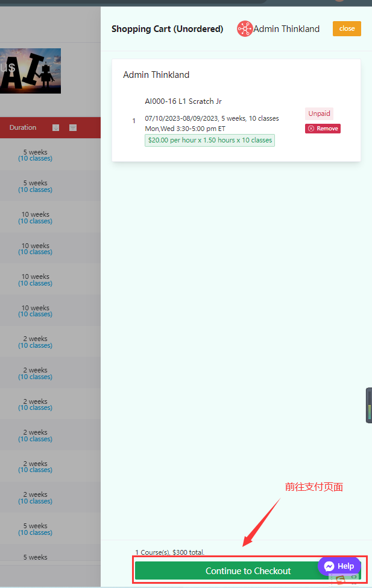
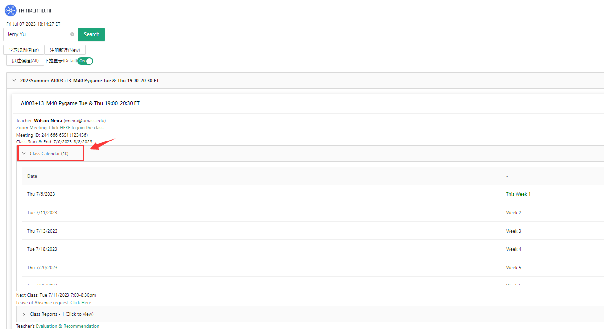
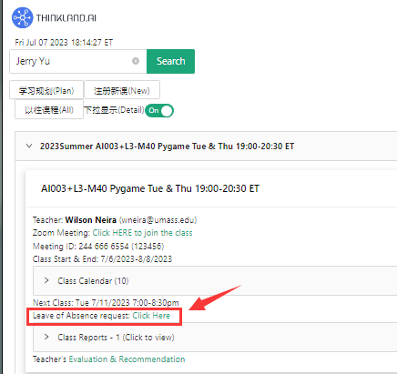
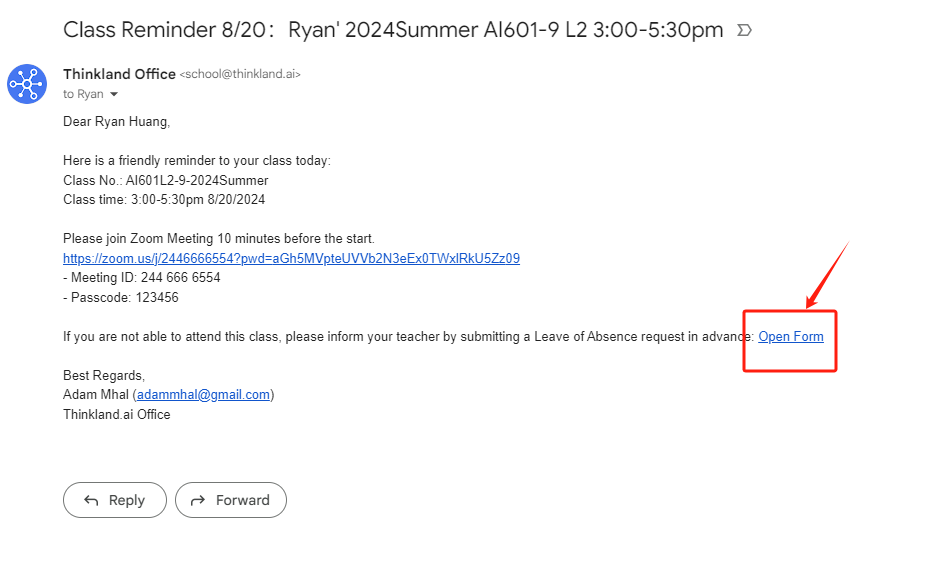
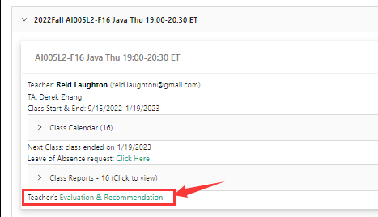
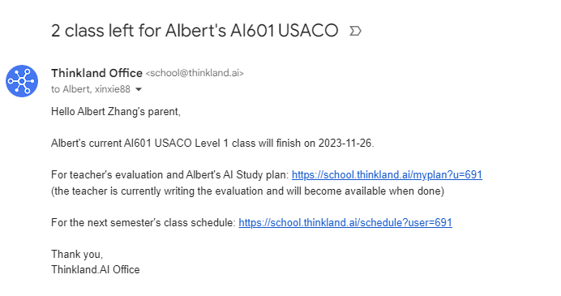
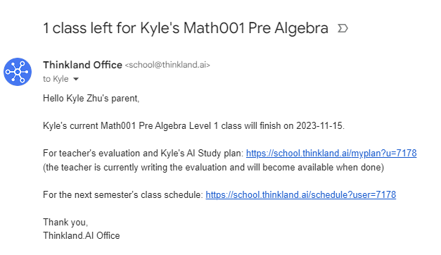
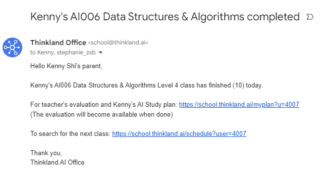

# 家长
## 一、报名/上课之前
### 1. 课程报名/付款
   - 进入https://school.thinkland.ai/schedule/
   - 根据老师推荐选择孩子下一阶段课程，加入购物车
     
     

   - 点击`continue to Checkout`去支付
     
     

### 2. 上课信息邮件
   - 上课开始前运营会发送一封上课信息邮件给学生

### 3. 上课日历查询
   - 点击https://thinkland.ai/myclass/ 输入名字或者邮箱即可查看当前上课的日历信息
     
     

### 4. 上课zoom查询
   - 点击https://thinkland.ai/myclass/ 输入名字或者邮箱即可查看当前上课班级的Zoom信息
 
     

### 5. 课前请假
   - 点击https://thinkland.ai/myclass/ 输入名字或者邮箱
   - 点击`leave of absence request`右边`Click Here`提交请假申请
 
     
     
   - 也可以点击课前提醒邮件里面的`Open form`提交请假申请
 
          

## 二、上课/课程结束后
### 1. Report查看
   - 点击https://thinkland.ai/myclass/ 输入名字或者邮箱
   - 点击`Class Report`即可下拉查看所有上课报告
 
     

### 2. Evaluation查看
   - 点击https://thinkland.ai/myclass/ 输入名字或者邮箱
   - 点击`Evaluation& Recommendation`即可下拉查看老师评级
 
     

### 3. 续课提醒
   - 当课次还剩下2次课的时候，系统会自动发送第一封续课提醒邮件
    

   - 当课次还剩下1次课的时候，系统会自动发送第二封续课提醒邮件
  

   - 当课程结束的时候，系统会自动发送第三封续课提醒邮件
  

